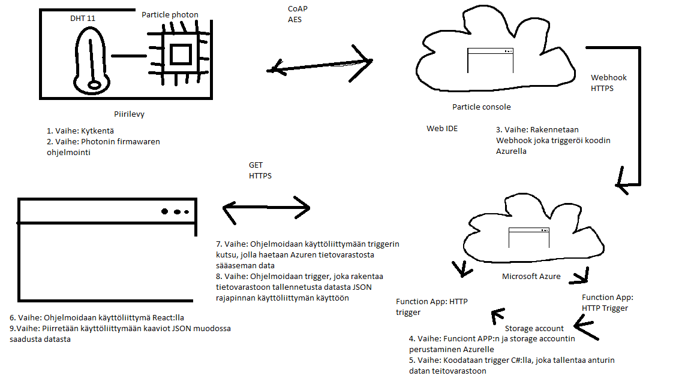
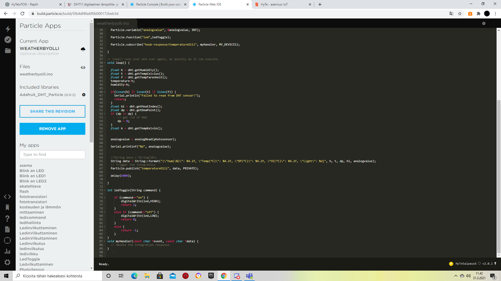
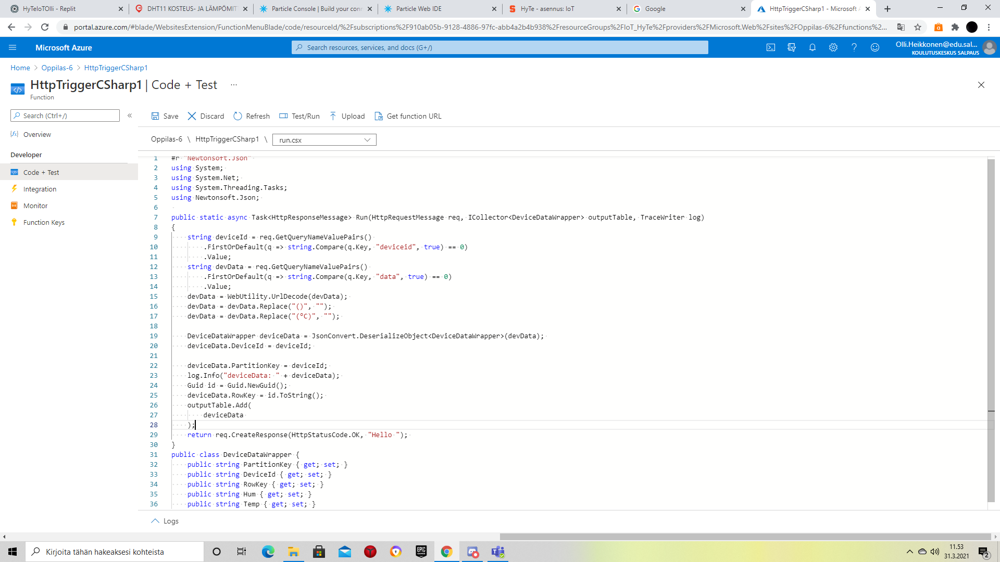
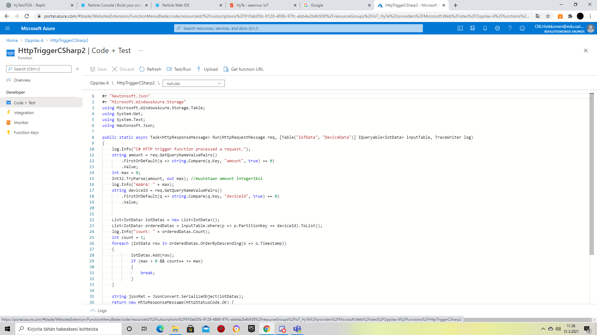
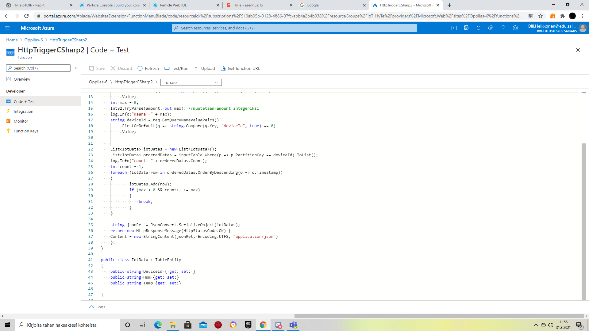

#  Iot

## Mikä IoT?
IoT eli internet of things.
Esineiden internet eli lyhyesti IoT (engl. Internet of Things) tarkoittaa esineiden liittämistä internetiin.
IoT-arkkitehtuuri koostuu useista liikkuvista osista, kuten laitteista, antureista, tallennustekniikoista ja verkoista.
Monelle yritykselle esineiden internet on keskeinen osa digitalisaatiostrategiaa. IoT avaa uusia mahdollisuuksia kaikilla toimialoilla vähentämällä kustannuksia, lisäämällä tehokkuutta, parantamalla toiminnan turvallisuutta ja luotettavuutta, luomalla uusia tulovirtoja ja parantamalla asiakastyytyväisyyttä.
Esineiden internet mahdollistaa töiden muuttamisen paikasta riippumattomaksi. Laitteita voidaan ohjata etänä ja dataa kerätä kohteista ilman käyntiä paikan päällä.
Laitteilla kerätään dataa fyysisestä ympäristöstä eli digitalisoidaan fyysinen ympäristö. Reaaliaikaisella datalla saat arvokasta tietoa liiketoiminnastasi.

Esimerkki: IoT:n avulla saadan vedet poikki vesivahingon sattuessa.

## Sääasemajärjestelmän toimintakaavio
##### IoT-järjestelmän rakenne:
```
- Anturi kerää dataa.
- Tietoliikenteen avulla antureiden dta viedään pilveen.
- Tietovarastoon tallennetaan data.
- Analytiikan avulla tallennettua dataa  hyödynnetään.
```

##### Kuva sääaseman rakenteesta:


##### Palvelut
```
- Sääasema käyttää Microsoft Azure pilvipalveluja.
- Hyödyt: Edullisempaa
- Huonot puolet: Yksityisyys, tietoturva
```

### Anturit:
```
- Kuuloanturista tulee A-painotettu desibeli arvo eli se yrittää ottaa huomioon miten ihmiskorva kuulee äänet. Sitä voi hyödyntää turvallisuudessa, liikenteessä sekä tutkinta työssä esimerkiksi. Kuuloanturi pystyy tunnistamaan esimerkiksi missä ammuttiin aseella, onko vanhus nukkumassa tai laulaako linnut.

- Tuntoanturi mittaa esimerkiksi kosteutta, painoa tai asentoa. Sitä voi hyödyntää esimerkiksi rakennustyömaalla, lääketieteessä tai rahti alalla. Sillä voi esimerkiksi nähdä onko potilas nielaissut pillerin, onko rakennuksessa vahinkoa tai paljonko joku laatikko painaa.

- Hajuanturi tunnistaa erilaisia yhdisteitä kaasuista. Hajuanturin avulla voi tunnistaa esimerkiksi homeongelman tai sairauden.

- Näköanturi kerää valoa ja värejä ympöristöstä. Sen avulla voidaan esimerkiksi valvoa tuotantoa, turvallisuutta ja ottaa valokuvia.

- DHT11 anturi mittaa kosteutta ja lämpötilaa. Siinä on neljä pinniä (VCC, Data, NC, GND). Kosteuden mittaus perustuu resistiiviseen elementtiin. Lämpötilan mittaus perustuu NTC vastukseen.
```
### Ohjelmointi


Particle Consolilla me ohjattiin Photonia.



Portal Azuressa teimme 2 triggeriä jotka ottavat vastaan ja lähettävät eteenpäin pilvessä.

## Termihakemisto
```
- Https on lyhenne sanoista hypertext transfer protocol secure. Https on salattu versio http:stä, joka on protokolla, jonka ehdoilla kaikki verkkosivut toimivat.
- AES (engl. Advanced Encryption Standard) on lohkosalausmenetelmä, jota käytetään tietotekniikassa.
- Webhook on tapa, jolla sovellus voi tarjota muille sovelluksille tietoja reaaliaikaisesti.
```

## Viitteet
https://www.empirica.fi/iot-ratkaisut/?utm_medium=ppc&utm_term=asioiden%20internet&utm_campaign=Website+traffic-Search-3&utm_source=adwords&hsa_kw=asioiden%20internet&hsa_cam=10894399158&hsa_ver=3&hsa_acc=8977936464&hsa_ad=459271225845&hsa_grp=106664272545&hsa_src=g&hsa_mt=b&hsa_tgt=kwd-306162688519&hsa_net=adwords&gclid=Cj0KCQjwo-aCBhC-ARIsAAkNQiv4XUPbZeV9wZ-xTmaentm-74G6Scob3dCsU9cdlM19MSuZg-Hxwx4aAg6TEALw_wcB

https://www.dna.fi/yrityksille/aistien-internet-podcast

https://ihmevekotin.fi/laempoetila-anturit/242-dht11-digitaalinen-laempoetila-ja-ilmankosteusanturi-johdolla.html